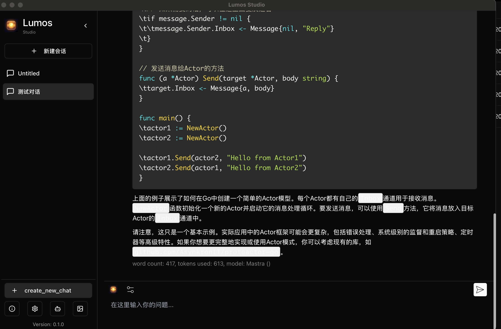
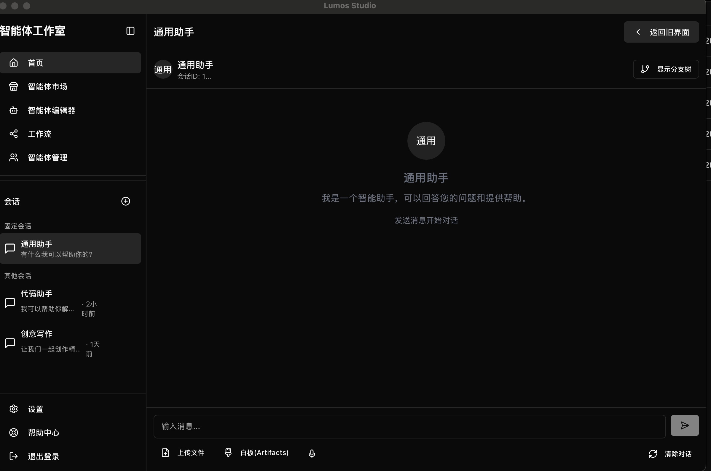
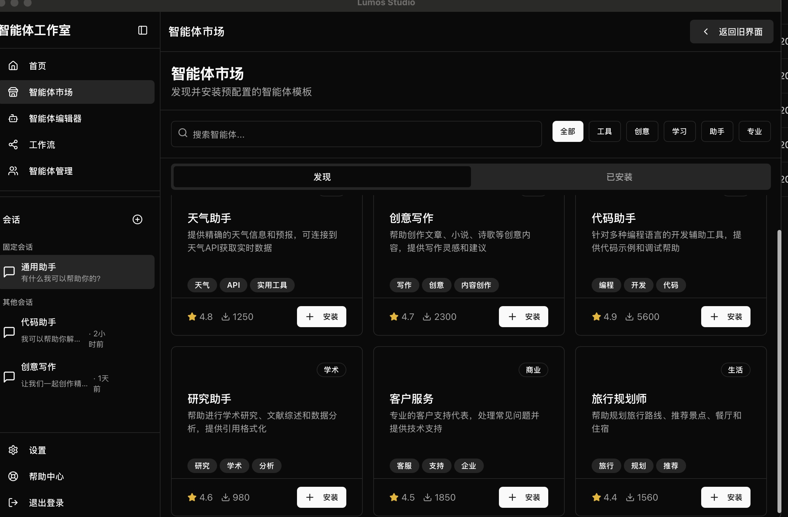

# Lumos Studio

基于Mastra框架的Lumos，借鉴LobeChat的用户体验和界面设计，打造现代化、易用且功能丰富的AI模型开发和部署平台。



## 主要功能

- **智能体管理**: 创建、编辑、删除和使用自定义AI智能体，支持多种模型和工具集成
- **智能白板**: 使用Excalidraw实现的交互式白板，支持绘图和分享到AI聊天
- **AI聊天**: 文字和语音聊天功能，可与AI助手交流
- **多模态支持**: 支持图像、文本、语音等多种输入方式
- **智能体工具**: 为智能体配置各种工具，如网络搜索、天气查询、计算器和图像生成
- **数据持久化**: 使用SQLite和Drizzle ORM进行智能体数据存储，支持完整的CRUD操作
- **操作日志**: 记录智能体的所有操作，便于调试和优化
- **可扩展架构**: 基于Mastra框架构建，易于扩展和定制

## 应用截图

### 智能体对话界面


### 智能体配置与工具


## 技术栈

- **前端**: React + Tailwind CSS + Shadcn UI
- **状态管理**: Jotai
- **数据持久化**: SQLite + Drizzle ORM
- **部署**: Tauri (桌面应用)
- **AI框架**: Mastra (基于 @mastra/core)
- **API通信**: @mastra/client-js

## 项目亮点分析

### 架构创新

- **去中心化智能体系统**: 采用去中心化架构，每个智能体可独立运行且相互协作，避免单点故障
- **可组合工具模式**: 基于工具组合模式设计的智能体工具系统，支持灵活组装不同功能
- **前后端解耦设计**: 使用HTTP API实现前后端完全解耦，便于独立开发和测试
- **状态原子化管理**: 使用Jotai实现原子化状态管理，提高应用性能和响应速度

### 性能优化

- **增量渲染**: 聊天消息采用增量渲染技术，提高大量消息渲染时的响应速度
- **延迟加载**: 非核心组件和大型依赖采用延迟加载策略，减少初始加载时间
- **SQLite索引优化**: 对数据库常用查询字段进行索引优化，提高查询效率
- **内存缓存**: 对频繁访问的智能体配置和历史记录实现内存缓存，减少磁盘IO

### 用户体验

- **响应式设计**: 完全响应式的UI设计，适配不同设备和屏幕尺寸
- **无缝语音交互**: 实现语音识别和合成的无缝集成，提供自然的语音交互体验
- **上下文感知界面**: 界面元素根据当前上下文智能调整，减少用户操作步骤
- **主题定制**: 支持明暗模式以及颜色主题自定义，满足不同用户偏好

## 架构详解

### 整体架构

```
┌─────────────────────────────────────────────────────────────┐
│                      Tauri 应用容器                          │
│  ┌────────────────┐           ┌─────────────────────────┐   │
│  │                │  HTTP API │                         │   │
│  │   React 前端   │◄─────────►│   Mastra 服务 (Node.js) │   │
│  │                │           │                         │   │
│  └────────────────┘           └─────────────────────────┘   │
│           ▲                              │                  │
│           │                              ▼                  │
│           │                    ┌─────────────────┐          │
│           └────────────────────┤   SQLite 数据库 │          │
│                                └─────────────────┘          │
└─────────────────────────────────────────────────────────────┘
```

### 数据流

1. **用户交互**: 用户通过前端UI与智能体交互
2. **请求处理**: React前端将请求通过HTTP API发送给Mastra服务
3. **智能体处理**: Mastra服务调用相应的智能体和工具处理请求
4. **数据持久化**: 处理结果通过Drizzle ORM存储到SQLite数据库
5. **响应返回**: 处理结果返回给前端UI并展示给用户

### 数据库结构

```
┌────────────────┐       ┌────────────────┐
│     agents     │       │   agent_logs   │
├────────────────┤       ├────────────────┤
│ id             │       │ id             │
│ name           │       │ agentId        │
│ description    │◄──────┤ operation      │
│ instructions   │       │ timestamp      │
│ model          │       │ details        │
│ temperature    │       └────────────────┘
│ maxTokens      │
│ tools          │       ┌────────────────┐
│ systemAgent    │       │   conversations│
│ createdAt      │       ├────────────────┤
│ updatedAt      │◄──────┤ id             │
└────────────────┘       │ agentId        │
                         │ title          │
                         │ createdAt      │
                         │ updatedAt      │
                         └────────────────┘
```

### 模块依赖

- **前端组件**: React组件通过Jotai Store访问共享状态
- **API客户端**: 提供与Mastra服务通信的统一接口
- **工具系统**: 基于Plugin模式设计，支持动态加载和注册工具
- **智能体系统**: 实现智能体的生命周期管理和调度

## 开发工作流

### 开发流程

1. **需求分析**: 明确功能需求和技术约束
2. **原型设计**: 使用Figma或其他工具进行UI原型设计
3. **前端开发**: 实现React组件和状态管理
4. **后端开发**: 实现Mastra智能体和工具
5. **集成测试**: 前后端集成测试
6. **部署发布**: 打包为Tauri应用并发布

### 调试技巧

- **前端调试**: 使用React DevTools和Jotai DevTools调试前端状态
- **API调试**: 使用Postman或Insomnia测试Mastra API
- **数据库调试**: 使用SQLite浏览器工具查看和修改数据库
- **日志分析**: 利用agentLogsTool记录的操作日志分析问题

### 性能监控

- **前端性能**: 监控组件渲染时间和内存占用
- **API响应时间**: 监控API请求的响应时间
- **数据库查询**: 监控数据库查询性能
- **智能体执行**: 监控智能体执行时间和资源消耗

## 高级使用示例

### 智能体工作流编排

```typescript
// 创建一个工作流智能体，协调多个专业智能体完成复杂任务
const workflowAgent = await agentStorageTool.execute({
  operation: 'create',
  agent: {
    name: "研究助理",
    description: "协调多个专业智能体完成研究任务",
    instructions: `你是一个研究助理，负责协调以下智能体完成研究任务：
    1. 搜索专家：负责查找相关资料
    2. 分析专家：负责分析资料并提炼关键信息
    3. 写作专家：负责生成研究报告
    根据用户的研究主题，你需要有序地调度这些智能体`,
    model: "gpt-4-turbo",
    temperature: 0.5,
    maxTokens: 8000,
    tools: JSON.stringify([
      "agent-executor", 
      "web-search", 
      "document-analysis",
      "report-generator"
    ]),
  }
});
```

### 自定义工具开发

```typescript
// 创建自定义数据分析工具
export const dataAnalysisTool = createTool({
  id: 'data-analysis',
  description: '分析数据集并生成统计报告',
  inputSchema: z.object({
    dataset: z.string(),
    analysisType: z.enum(['descriptive', 'predictive', 'prescriptive']),
    options: z.object({
      visualize: z.boolean().optional(),
      exportFormat: z.enum(['json', 'csv', 'pdf']).optional()
    }).optional()
  }),
  outputSchema: z.object({
    success: z.boolean(),
    report: z.any().optional(),
    error: z.string().optional()
  }),
  execute: async (context) => {
    const { dataset, analysisType, options } = context as any;
    
    try {
      // 实现数据分析逻辑
      const result = await analyzeData(dataset, analysisType, options);
      
      // 记录操作日志
      await addAgentLog({
        agentId: context.agentId || 'system',
        operation: 'data-analysis',
        details: JSON.stringify({ dataset, analysisType, options })
      });
      
      return {
        success: true,
        report: result
      };
    } catch (error) {
      return {
        success: false,
        error: `数据分析失败: ${error.message}`
      };
    }
  }
});
```

## 项目结构

```
lumos-studio/
├── src/              # 前端代码
│   ├── api/          # API客户端和服务
│   ├── components/   # React组件
│   ├── stores/       # Jotai状态管理
│   └── utils/        # 工具函数
├── mastrax/          # Mastra后端
│   ├── src/
│   │   ├── mastra/
│   │   │   ├── agents/    # 智能体定义
│   │   │   ├── db/        # 数据库模型和迁移
│   │   │   ├── logging/   # 日志系统
│   │   │   └── tools/     # 工具定义
│   └── drizzle/      # 数据库迁移脚本
└── src-tauri/        # Tauri桌面应用代码
```

## 快速开始

### 安装依赖

```bash
pnpm install
```

### 启动开发服务器

```bash
# 启动Mastra服务
cd mastrax && PORT=4112 pnpm dev

# 启动前端开发服务器
pnpm dev

# 启动Tauri应用
pnpm tauri dev
```

### 构建应用

```bash
pnpm build
pnpm tauri build
```

## 智能体存储与工具

本项目实现了完整的智能体管理系统，支持以下功能：

- **智能体CRUD操作**: 通过`agentStorageTool`实现智能体的创建、读取、更新和删除
- **操作日志记录**: 使用`agentLogsTool`记录所有智能体操作，便于追踪和调试
- **数据持久化**: 使用SQLite作为存储引擎，通过Drizzle ORM进行数据访问
- **工具集成**: 支持网络搜索、天气查询、计算器和图像生成等工具

### 工具使用示例

```typescript
// 创建智能体
const result = await agentStorageTool.execute({
  operation: 'create',
  agent: {
    name: "天气助手",
    description: "提供天气预报服务",
    instructions: "你是一个天气查询助手",
    model: "gpt-4-turbo",
    temperature: 0.7,
    maxTokens: 4000,
    tools: JSON.stringify(["weather"]),
  }
});

// 记录操作日志
await addAgentLog({
  agentId: "agent-123",
  operation: "chat",
  details: JSON.stringify({ query: "今天天气如何？" })
});
```

## 已完成功能

- ✅ 基础UI界面
- ✅ 文字聊天组件
- ✅ 语音聊天组件
- ✅ 白板组件
- ✅ Jotai状态管理
- ✅ SQLite数据持久化
- ✅ 智能体工具系统
- ✅ 操作日志记录

## 后续计划

- 分支对话功能优化
- 本地模型支持
- 插件系统扩展
- 更多AI服务提供商集成
- 数据分析与可视化
- 智能体性能监控

## 联系我们

如有任何问题或建议，请提交issue或联系开发团队。
